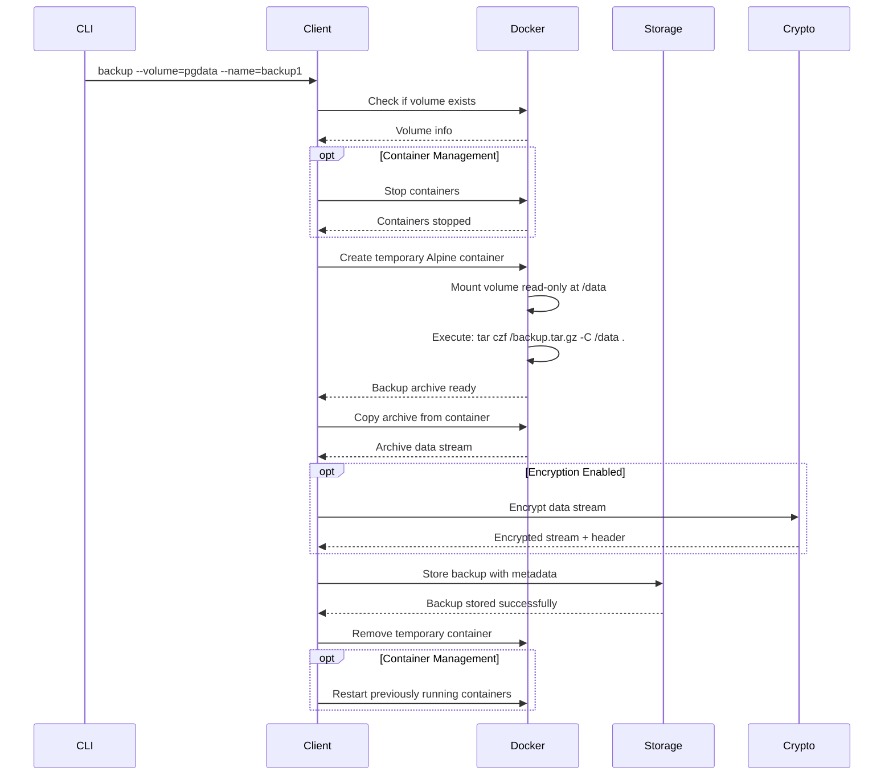
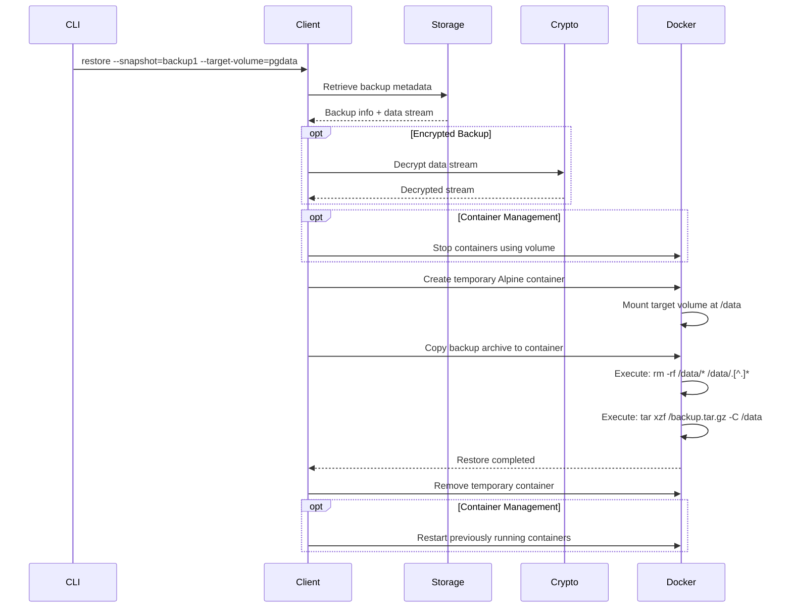

# Architecture Guide

Understanding how DVOM works internally, its design principles, and implementation details.

## 🏗️ High-Level Architecture

```
┌─────────────────┐    ┌─────────────────┐    ┌─────────────────┐
│   CLI Layer     │    │  Progress UI    │    │  Encryption     │
│  (Cobra/Flags)  │    │ (Progress Bars) │    │  (AES-256-GCM)  │
└─────────────────┘    └─────────────────┘    └─────────────────┘
         │                       │                       │
         └───────────────────────┼───────────────────────┘
                                 │
         ┌─────────────────────────────────────────────────┐
         │              Backup Client                      │
         │        (Orchestration & Logic)                  │
         └─────────────────────────────────────────────────┘
                                 │
         ┌───────────────────────┼───────────────────────┐
         │                       │                       │
┌─────────────────┐    ┌─────────────────┐    ┌─────────────────┐
│  Docker Client  │    │ Storage Backend │    │   Metadata      │
│   (Volume Ops)  │    │ (Local/S3/GCS)  │    │  Management     │
└─────────────────┘    └─────────────────┘    └─────────────────┘
```

## 🔧 Core Components

### 1. CLI Layer (`cmd/dvom/main.go`)
- **Purpose**: Command-line interface and flag parsing
- **Framework**: Cobra for command structure
- **Responsibilities**:
  - Parse command-line arguments
  - Initialize storage backends
  - Configure encryption settings
  - Handle global flags and validation

### 2. Backup Client (`internal/backup/client.go`)
- **Purpose**: Main orchestration layer
- **Responsibilities**:
  - Coordinate backup/restore operations
  - Manage Docker client connections
  - Handle storage backend configuration
  - Control encryption settings

### 3. Docker Operations (`internal/docker/client.go`)
- **Purpose**: Docker daemon interaction
- **Responsibilities**:
  - Volume discovery and validation
  - Container management (stop/start)
  - Temporary container creation for backups
  - Volume mounting and access control

### 4. Storage Backends (`internal/storage/`)
- **Purpose**: Pluggable storage system
- **Implementations**:
  - **Local**: Filesystem storage
  - **S3**: AWS S3 and compatible services
  - **GCS**: Google Cloud Storage
- **Interface**: Common `Backend` interface for all implementations

### 5. Encryption System (`internal/crypto/crypto.go`)
- **Purpose**: Optional AES-256-GCM encryption
- **Features**:
  - Streaming encryption/decryption
  - PBKDF2 key derivation
  - Secure nonce generation
  - Format versioning

### 6. Progress System (`internal/backup/progress.go`)
- **Purpose**: Real-time progress tracking
- **Features**:
  - Upload/download progress bars
  - Speed calculation and ETA
  - Indeterminate spinners for unknown operations

## 🔄 Backup Process Flow

### 1. Volume Backup Process



### 2. Volume Restore Process



## 🗄️ Storage Architecture

### Interface Design

```go
type Backend interface {
    Store(ctx context.Context, backup *Backup) error
    Retrieve(ctx context.Context, id string) (*Backup, error)
    List(ctx context.Context) ([]BackupMetadata, error)
    Delete(ctx context.Context, id string) error
    Exists(ctx context.Context, id string) (bool, error)
}
```

### Backup Metadata Structure

```go
type BackupMetadata struct {
    ID          string    `json:"id"`
    Name        string    `json:"name"`
    Type        string    `json:"type"`
    Size        int64     `json:"size"`
    CreatedAt   time.Time `json:"created_at"`
    VolumeName  string    `json:"volume_name,omitempty"`
    Description string    `json:"description,omitempty"`
    Version     string    `json:"version,omitempty"`
    Encrypted   bool      `json:"encrypted,omitempty"`
}
```

### Versioning System

DVOM implements automatic versioning for backups with the same name:

- **Format**: `backup-name@YYYYMMDD-HHMMSS`
- **Storage**: Each version stored as separate object
- **Metadata**: Tracks version count and latest version
- **Listing**: Shows consolidated view with version information

## 🔐 Encryption Architecture

### Encryption Flow

```
Original Data → PBKDF2 Key Derivation → AES-256-GCM Encryption → Storage
     ↓                    ↓                       ↓
  Volume Data    Password + Salt         Encrypted Chunks    Backend
```

### Security Implementation

1. **Key Derivation**:
   ```go
   key := pbkdf2.Key(password, salt, 100000, 32, sha256.New)
   ```

2. **Nonce Generation**:
   ```go
   baseNonce := generateRandomNonce(12)  // 96-bit nonce
   chunkNonce := baseNonce XOR counter   // Unique per chunk
   ```

3. **File Format**:
   ```
   [DVOM-ENC][Version][Salt][BaseNonce][EncryptedData...]
     8 bytes  1 byte  32 bytes 12 bytes    Variable
   ```

### Counter-Based Nonce System

To prevent nonce reuse (critical security requirement for GCM):

```go
// For each 64KB chunk
chunkNonce := make([]byte, len(baseNonce))
copy(chunkNonce, baseNonce)

// XOR counter into nonce to ensure uniqueness
for i := 0; i < 8 && i < len(chunkNonce); i++ {
    chunkNonce[len(chunkNonce)-1-i] ^= byte(counter >> (8 * i))
}

encryptedChunk := aead.Seal(nil, chunkNonce, plainChunk, nil)
counter++
```

## 📊 Progress Tracking Architecture

### Progress Types

1. **Determinate Progress** (Known size):
   - Upload/download operations
   - File transfers with known sizes
   - Shows percentage, speed, ETA

2. **Indeterminate Progress** (Unknown duration):
   - Docker operations
   - Container creation/deletion
   - Shows spinner animation

### Implementation

```go
type ProgressReader struct {
    reader io.Reader
    bar    *pb.ProgressBar
}

func (pr *ProgressReader) Read(p []byte) (int, error) {
    n, err := pr.reader.Read(p)
    pr.bar.Add(n)  // Update progress
    return n, err
}
```

## 🐳 Docker Integration

### Container Strategy

DVOM uses temporary Alpine Linux containers for volume access:

1. **Security**: No direct filesystem access required
2. **Portability**: Works across different Docker setups
3. **Isolation**: Operations contained within Docker boundaries
4. **Cleanup**: Automatic container removal after operations

### Volume Access Pattern

```bash
# Backup: Read-only mount
docker run --rm \
  -v volume-name:/data:ro \
  alpine:latest \
  tar czf /backup.tar.gz -C /data .

# Restore: Read-write mount with cleanup
docker run --rm \
  -v volume-name:/data \
  alpine:latest \
  sh -c "rm -rf /data/* /data/.[^.]* && tar xzf /backup.tar.gz -C /data"
```

### Container Management

```go
type ContainerManager struct {
    docker *docker.Client
}

func (cm *ContainerManager) StopContainers(names []string) (map[string]bool, error) {
    stopped := make(map[string]bool)
    for _, name := range names {
        wasRunning, err := cm.stopContainer(name)
        stopped[name] = wasRunning
    }
    return stopped, nil
}
```

## 🔌 Plugin Architecture

### Storage Backend Plugins

The storage system is designed for extensibility:

```go
type Backend interface {
    Store(ctx context.Context, backup *Backup) error
    // ... other methods
}

// Factory pattern for backend creation
func NewBackend(ctx context.Context, config *Config) (Backend, error) {
    switch config.Type {
    case "local":
        return NewLocalBackend(config.Local)
    case "s3":
        return NewS3Backend(ctx, config.S3)
    case "gcs":
        return NewGCSBackend(ctx, config.GCS)
    default:
        return nil, fmt.Errorf("unknown storage type: %s", config.Type)
    }
}
```

### Adding New Storage Backends

To add a new storage backend:

1. Implement the `Backend` interface
2. Add configuration struct
3. Update factory function
4. Add CLI flags for configuration

## 🏃‍♂️ Performance Considerations

### Memory Usage

- **Streaming Operations**: Constant memory usage regardless of backup size
- **Buffer Size**: 64KB chunks for optimal performance
- **Progress Tracking**: Minimal overhead with efficient updates

### I/O Optimization

- **Direct Streaming**: No intermediate files for cloud storage
- **Concurrent Operations**: Parallel upload/download where possible
- **Connection Pooling**: Reuse HTTP connections for cloud APIs

### Docker Efficiency

- **Image Caching**: Uses lightweight Alpine Linux (5MB)
- **Container Reuse**: Minimal container lifecycle overhead
- **Volume Mounting**: Direct kernel-level volume access

## 🧪 Testing Architecture

### Test Structure

```
tests/
├── unit/           # Unit tests for individual components
├── integration/    # Integration tests with Docker
├── e2e/           # End-to-end testing scenarios
└── fixtures/      # Test data and configurations
```

### Test Categories

1. **Unit Tests**: Individual component testing
2. **Integration Tests**: Docker and storage backend testing
3. **Security Tests**: Encryption and decryption validation
4. **Performance Tests**: Large volume and network testing

## 📈 Scalability Design

### Horizontal Scaling

- **Stateless Operations**: Each backup/restore is independent
- **Parallel Execution**: Multiple DVOM instances can run simultaneously
- **Storage Backend Scaling**: Leverages cloud storage scalability

### Vertical Scaling

- **Memory Efficient**: Constant memory usage
- **CPU Efficient**: Minimal processing overhead
- **I/O Efficient**: Streaming operations minimize disk usage

## 🔧 Configuration Management

### Configuration Sources (Priority Order)

1. Command-line flags (highest priority)
2. Environment variables
3. Configuration files
4. Default values (lowest priority)

### Environment Variable Mapping

```bash
DVOM_STORAGE=s3          # --storage=s3
DVOM_S3_BUCKET=backups   # --s3-bucket=backups
DVOM_ENCRYPT=true        # --encrypt
DVOM_QUIET=true          # --quiet
```

## 🚀 Future Architecture Considerations

### Planned Enhancements

1. **Plugin System**: Dynamic plugin loading for storage backends
2. **API Server**: REST API for programmatic access
3. **Web UI**: Browser-based management interface
4. **Clustering**: Distributed backup coordination
5. **Caching**: Intelligent caching for metadata operations

### Extension Points

- **Custom Compression**: Pluggable compression algorithms
- **Custom Encryption**: Alternative encryption providers
- **Custom Notifications**: Webhook and notification systems
- **Custom Schedulers**: Advanced scheduling capabilities

This architecture provides a solid foundation for reliable, secure, and scalable Docker volume backup operations while maintaining simplicity and ease of use.